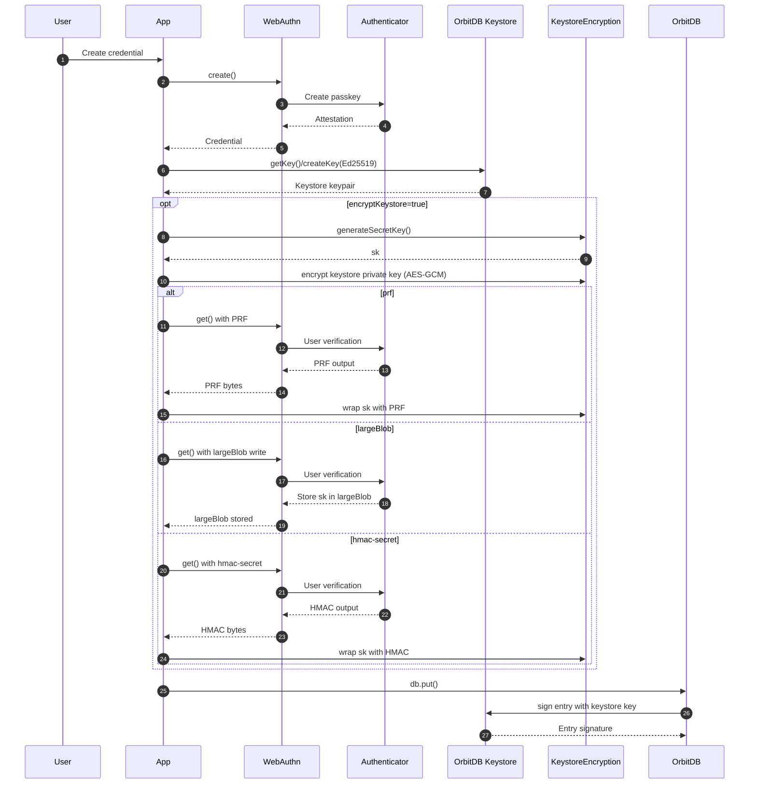
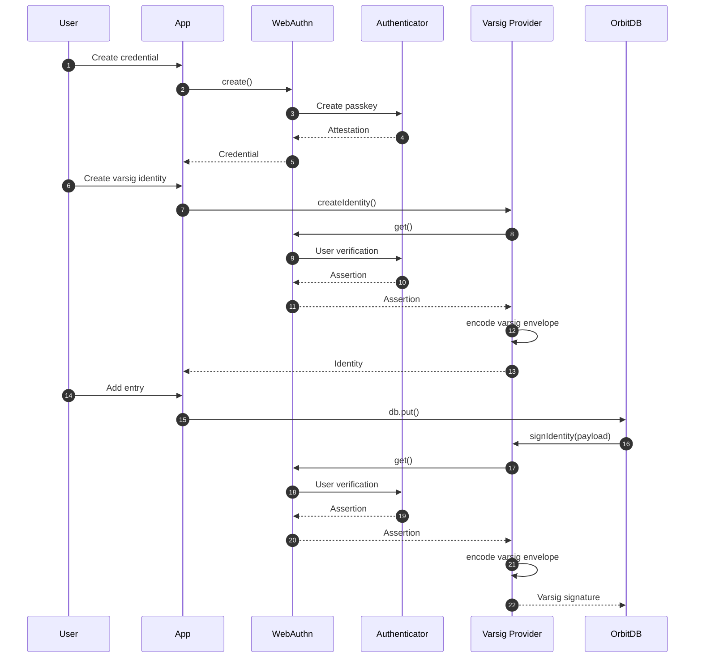

# OrbitDB WebAuthn Identity Providers

[](https://github.com/le-space/orbitdb-identity-provider-webauthn-did/actions/workflows/test.yml) [](https://github.com/le-space/orbitdb-identity-provider-webauthn-did/actions/workflows/ci-cd.yml)

*** Warning: The latest keystore encryption feature is currently getting reviewed. It is possible the below announced hmac+secret encryption is bypassed. That means the private key of the DID is still unencrypted in localstorage. You can use the library but be aware of malicious browser extensions can steal this private key. This does not effect your passkeys or hardware wallets keys***

⚠️ **SECURITY AUDIT WARNING**: This library has not undergone a formal security audit. While it implements industry-standard WebAuthn and cryptographic protocols, do not use in production environments. We recommend thorough testing and security review before deploying in critical applications.

Two WebAuthn-based OrbitDB identity providers:
- **Keystore-based DID**: WebAuthn for identity, OrbitDB keystore for fast entry signing (optional encryption).
- **Varsig**: No OrbitDB keystore; each entry is signed by WebAuthn with a varsig envelope - with the hardware secured passkey

## Variant Overview

**Recommendation (security-first):**
- **Best security:** Varsig provider. Keys never leave the authenticator; every write requires a WebAuthn assertion.
- **Best balance:** Keystore provider with WebAuthn-encrypted keystore. One prompt per session, fast writes, but the key exists in memory while unlocked.

⚠️ **Security**: Highly experimental release. No formal audit. Use only after your own review.

Note: WebAuthn varsig support in this repo relies on our forked `@le-space/iso-*` packages of [Hugo Dias iso-repo](https://github.com/hugomrdias/iso-repo/) (notably `@le-space/iso-did` and `@le-space/iso-webauthn-varsig`) to align with the updated varsig flow.


## Install

```bash
npm install orbitdb-identity-provider-webauthn-did
```

Note: `@orbitdb/core` is patched (via `patch-package`) to support Ed25519 keystore keys.

## Quick Start

```javascript
import { WebAuthnDIDProvider, OrbitDBWebAuthnIdentityProviderFunction } from 'orbitdb-identity-provider-webauthn-did';

const credential = await WebAuthnDIDProvider.createCredential({
  userId: 'alice@example.com',
  displayName: 'Alice'
});

const identity = await identities.createIdentity({
  provider: OrbitDBWebAuthnIdentityProviderFunction({ webauthnCredential: credential })
});
```


### Keystore-based DID (WebAuthn + OrbitDB keystore)



### Varsig (no keystore)



## Examples

Svelte demos:
- `examples/webauthn-todo-demo/` - WebAuthn DID (no keystore signing; identity-only).
- `examples/ed25519-encrypted-keystore-demo/` - Ed25519 keystore DID with optional WebAuthn encryption.
- `examples/webauthn-varsig-demo/` - Varsig provider with passkey signing for each entry.

Scripted examples:
- `examples/ed25519-keystore-did-example.js` - Keystore DID flow.
- `examples/encrypted-keystore-example.js` - Keystore encryption flow.
- `examples/simple-encryption-integration.js` - Keystore + database content encryption.

Mermaid sequences for scripts:
- `docs/EXAMPLE-SEQUENCES.md`

## Documentation

- `docs/USAGE-GUIDE.md`
- `docs/ED25519-KEYSTORE-DID.md`
- `docs/WEBAUTHN-ENCRYPTED-KEYSTORE-INTEGRATION.md`
- `docs/WEBAUTHN-DID-AND-ORBITDB-IDENTITY.md`

## License

MIT. See `LICENSE`.
