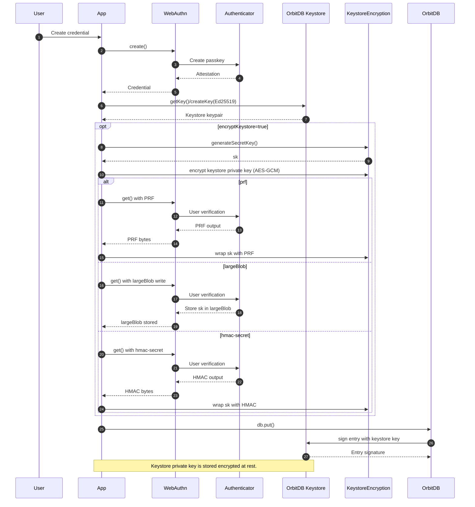
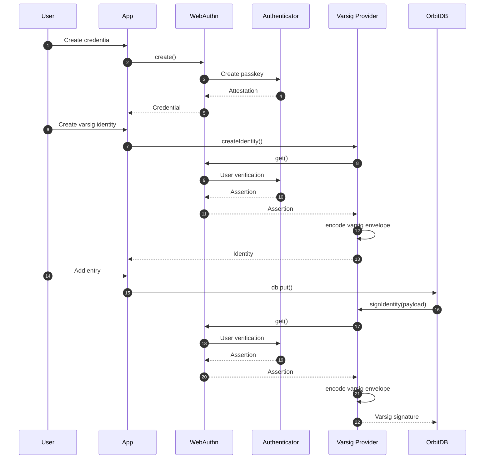

# OrbitDB WebAuthn Identity Providers

[](https://github.com/le-space/orbitdb-identity-provider-webauthn-did/actions/workflows/test.yml) [](https://github.com/le-space/orbitdb-identity-provider-webauthn-did/actions/workflows/ci-cd.yml)

⚠️ **Security**: Highly experimental release. No formal audit. Use only after your own review.


Two WebAuthn-based OrbitDB identity providers with distinct trade-offs:

- **WebAuthn-Varsig**: No insecure OrbitDB keystore at all. Each entry is signed by WebAuthn (varsig envelope), so keys never leave the authenticator, one WebAuthn prompt per write.

- **Keystore-based DID**: Generates an Ed25519/secp256k1 keystore keypair for OrbitDB signing in browser memory. When `encryptKeystore` is enabled, the private key is encrypted with AES-GCM and only rehydrated in memory after a WebAuthn unlock (PRF, largeBlob, or hmac-secret). 

**Recommendation (security-first):**

- **Best security:** Varsig provider (hardware-backed key for every write).
- **Best balance:** Keystore provider with WebAuthn-encrypted keystore (fewer prompts, faster writes, key material in memory during session).

Note: WebAuthn varsig support in this repo relies on our forked `@le-space/iso-*` packages of [Hugo Dias iso-repo](https://github.com/hugomrdias/iso-repo/) (notably `@le-space/iso-did` and `@le-space/iso-webauthn-varsig`) to align with the updated varsig flow.


## Install

```bash
npm install orbitdb-identity-provider-webauthn-did
```

Note: `@orbitdb/core` is patched (via `patch-package`) to support Ed25519 keystore keys.

## Memory Keystore Quick Start

```javascript
import { WebAuthnDIDProvider, OrbitDBWebAuthnIdentityProviderFunction } from 'orbitdb-identity-provider-webauthn-did';

const credential = await WebAuthnDIDProvider.createCredential({
  userId: 'alice@example.com',
  displayName: 'Alice'
});

const identity = await identities.createIdentity({
  provider: OrbitDBWebAuthnIdentityProviderFunction({ webauthnCredential: credential })
});
```

### Hardware Secured - Varsig Quick Start

```javascript
import { WebAuthnVarsigProvider, createWebAuthnVarsigIdentity } from 'orbitdb-identity-provider-webauthn-did';

const credential = await WebAuthnVarsigProvider.createCredential({
  userId: 'alice@example.com',
  displayName: 'Alice'
});

const identity = await createWebAuthnVarsigIdentity({ credential });
```


### Keystore-based DID (WebAuthn + OrbitDB keystore)



### Varsig (no keystore)



## Examples

Svelte demos:
- `examples/webauthn-todo-demo/` - WebAuthn DID (no keystore signing; identity-only).
- `examples/ed25519-encrypted-keystore-demo/` - Ed25519 keystore DID; keystore encrypted at rest with WebAuthn (PRF when available, otherwise largeBlob/hmac-secret).
- `examples/webauthn-varsig-demo/` - Varsig provider with passkey signing for each entry. Live demo: https://dweb.link/ipfs/bafybeib6tpwiby7pik67ufb3lxpr3j4by2l7r3ov3zzk6hjbzjzgsvckhy

Scripted examples:
- `examples/ed25519-keystore-did-example.js` - Keystore DID flow.
- `examples/encrypted-keystore-example.js` - Keystore encryption flow.
- `examples/simple-encryption-integration.js` - Keystore + database content encryption.

Mermaid sequences for scripts:
- `docs/EXAMPLE-SEQUENCES.md`

## Documentation

- `docs/USAGE-GUIDE.md`
- `docs/ED25519-KEYSTORE-DID.md`
- `docs/WEBAUTHN-ENCRYPTED-KEYSTORE-INTEGRATION.md`
- `docs/WEBAUTHN-DID-AND-ORBITDB-IDENTITY.md`

## License

MIT. See `LICENSE`.
