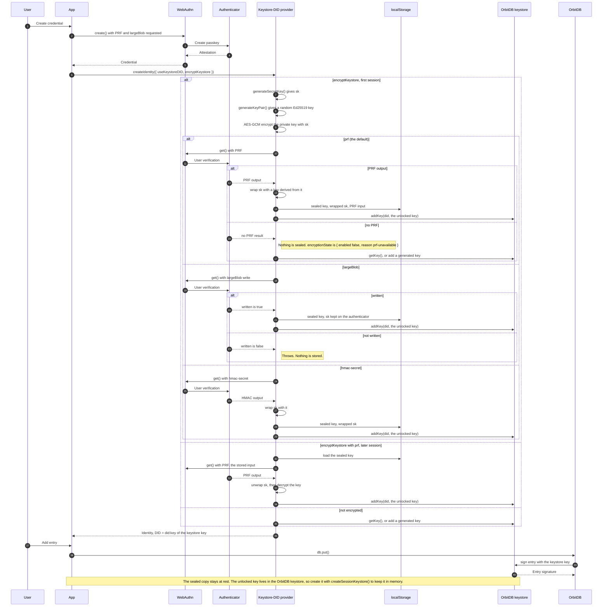
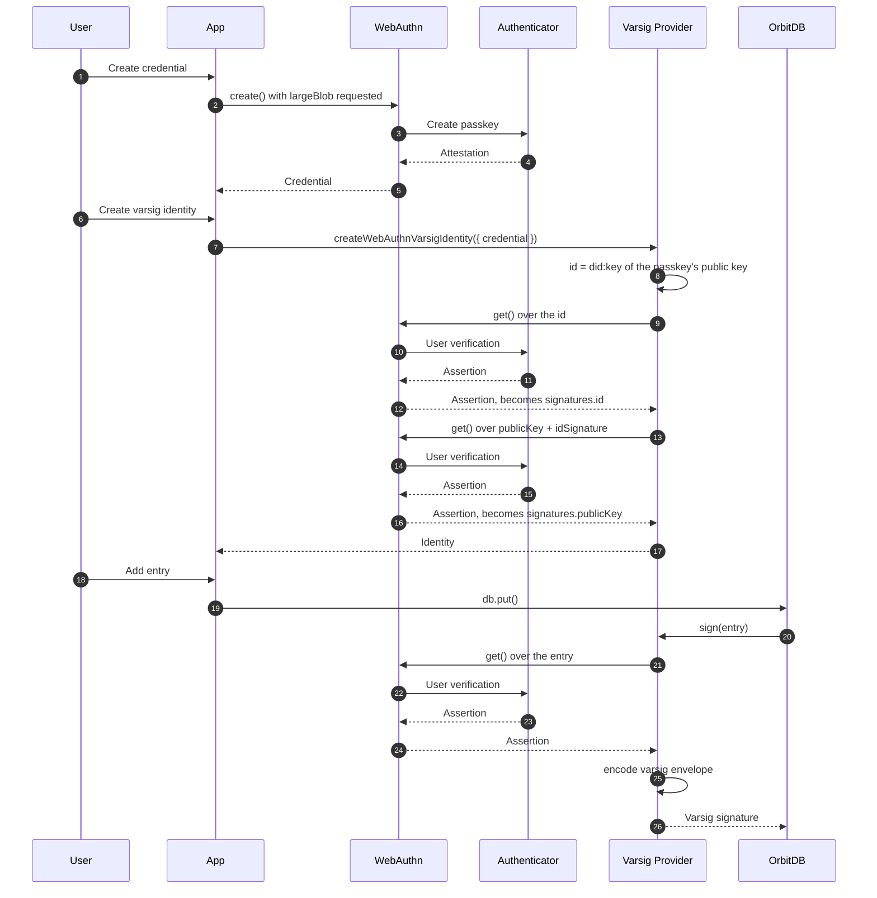

# OrbitDB WebAuthn Identity Providers

[](https://github.com/le-space/orbitdb-identity-provider-webauthn-did/actions/workflows/ci.yml)

⚠️ **Security**: Experimental release. No formal audit. Use only after your own review.

This package provides:

- Two WebAuthn-based OrbitDB identity providers.
- A standalone WebAuthn toolkit export (`@le-space/orbitdb-identity-provider-webauthn-did/standalone`) for reuse outside OrbitDB identity wiring.
- A keystore helper export (`@le-space/orbitdb-identity-provider-webauthn-did/keystore`) for encrypted keystore utilities and provider wiring.
- **WebAuthn-Varsig**: No insecure OrbitDB keystore at all. Each entry is signed by WebAuthn (varsig envelope), so keys never leave the authenticator, one Passkey (WebAuthn) prompt per write.
- **Passkey DID with a derived signing key** (the default): the DID is the credential's own P-256 key, and OrbitDB signs entries with a key derived from the passkey's PRF output (HKDF-SHA256, domain-separated by the DID) — secp256k1 by default, Ed25519 with `signingKeyType: 'Ed25519'`. The same passkey yields the same identity document on every device. That key lives in OrbitDB's keystore and is **not** covered by `encryptKeystore`; without PRF the keystore generates one, which then stays on that device.
- **Keystore-based DID**: an Ed25519/secp256k1 key pair in the OrbitDB keystore is the identity and signs entries. With `encryptKeystore` a sealed copy of that key sits in localStorage and the passkey unlocks it once per session (PRF; largeBlob or hmac-secret where supported). The unlocked key then lives in OrbitDB's own keystore — give OrbitDB `createSessionKeystore()` so that copy stays in memory; with the default keystore it is written to IndexedDB unencrypted, and the provider warns. Without PRF nothing is sealed: the key goes in unencrypted and `provider.encryptionState` says so.

## Current WebAuthn Model

- Discoverable credentials are enabled by default across the shared WebAuthn config.
- Authentication/assertion requests omit `allowCredentials` by default, so the browser/authenticator can resolve the credential discoverably.
- You can switch this centrally with `configureWebAuthn({ discoverableCredentials: true|false })`.
- Registration is still the point where this package extracts the credential public key from attestation.
- Later `navigator.credentials.get()` assertions do not reliably return the public key again, so identity reconstruction still needs metadata from somewhere else.

Since **0.6.0** the passkey alone is enough, and stored metadata is a convenience rather than a requirement:

- **From the authenticator**: `restoreIdentityFromAuthenticator()` asks the same passkey twice and reconstructs the DID from the two signatures and the signing key from the PRF output, with nothing kept anywhere — see [Identity Recovery Summary](#identity-recovery-summary).
- **From a stored copy**, when an application keeps one: WebAuthn `largeBlob`, or browser `localStorage`. It costs no touch at all, which is the only reason to keep one.

`largeBlob` is requested at registration since 0.5.4 ([#55](https://github.com/Le-Space/orbitdb-identity-provider-webauthn-did/pull/55)), but it is not a path to rely on. Measured on hardware: Android Chrome writes the blob and does not return it on read, while desktop Chrome reads it ([#48](https://github.com/Le-Space/orbitdb-identity-provider-webauthn-did/issues/48)).

**Which option, and what each one actually gives you:**

|                                  | Default (passkey DID + derived key)                                                          | Keystore DID + `encryptKeystore`                                                                    | Varsig                                    |
| -------------------------------- | -------------------------------------------------------------------------------------------- | --------------------------------------------------------------------------------------------------- | ----------------------------------------- |
| DID                              | the passkey's P-256 key                                                                      | the keystore key (Ed25519/secp256k1)                                                                | the passkey's key                         |
| Signs an entry                   | a key derived from the passkey's PRF output (secp256k1, or Ed25519 with `signingKeyType`)    | the keystore key, sealed by the passkey and unlocked once per session                               | the passkey, every write                  |
| Prompts per write                | 0                                                                                            | 0                                                                                                   | 1                                         |
| Prompts per session              | 0 after the first (the identity assertion is stored)                                         | 1 (unlock)                                                                                          | 2 (identity assertions)                   |
| Same identity on a second device | yes, given PRF                                                                               | no — a new keystore key, unless the sealed copy travels                                             | yes                                       |
| At rest in the browser           | the derived key, **unencrypted**, in OrbitDB's keystore                                      | the sealed copy only, **if** OrbitDB gets `createSessionKeystore()`; otherwise the unlocked key too | nothing                                   |
| Without PRF                      | a generated key, one device only                                                             | not sealed at all (`encryptionState.reason === 'prf-unavailable'`)                                  | unaffected                                |
| What a peer verifies             | the WebAuthn assertion binding the DID's key to the derived key, then each entry's signature | the DID is the signing key, then each entry's signature                                             | each entry's varsig against the DID's key |

Varsig is the only option with no signing key in JavaScript at all; it costs a prompt per write and binds entries to the origin. The default is the cheapest and moves with the passkey, but leaves a software key on disk. The sealed keystore sits between, and only means something at rest with a session keystore.

Note: WebAuthn varsig support in this repo relies on our forked `@le-space/iso-*` packages of [Hugo Dias iso-repo](https://github.com/hugomrdias/iso-repo/) (notably `@le-space/iso-did` and `@le-space/iso-webauthn-varsig`) to align with the updated varsig flow.

## Install

```bash
npm install @le-space/orbitdb-identity-provider-webauthn-did
```

Note: Ed25519 keystore DIDs are handled without patching OrbitDB. The provider generates the requested libp2p key type and stores it through OrbitDB's public keystore API.

## WebAuthn Configuration

The package now exposes a central WebAuthn policy API:

```javascript
import {
  configureWebAuthn,
  getWebAuthnConfig,
  resetWebAuthnConfig,
} from '@le-space/orbitdb-identity-provider-webauthn-did';

configureWebAuthn({ discoverableCredentials: true }); // default
console.log(getWebAuthnConfig());
resetWebAuthnConfig();
```

Behavior:

- `discoverableCredentials: true`
  - registration requests resident/discoverable credentials
  - assertion requests omit `allowCredentials`
- `discoverableCredentials: false`
  - assertion requests target a specific credential ID via `allowCredentials`

## Memory Keystore Quick Start

```javascript
import {
  WebAuthnDIDProvider,
  OrbitDBWebAuthnIdentityProviderFunction,
} from '@le-space/orbitdb-identity-provider-webauthn-did';

const credential = await WebAuthnDIDProvider.createCredential({
  userId: 'alice@example.com',
  displayName: 'Alice',
});

const identity = await identities.createIdentity({
  provider: OrbitDBWebAuthnIdentityProviderFunction({
    webauthnCredential: credential,
  }),
});
```

### Discoverable Recovery Notes

For the DID-based flow:

- `createCredential()` can extract the public key from attestation and derive a DID from it.
- later discoverable `navigator.credentials.get()` proves possession of the credential, but usually returns only `rawId`, `authenticatorData`, `clientDataJSON`, `signature`, and maybe `userHandle`
- that assertion is not enough on its own to reconstruct the DID

Two ways past that, and the first keeps nothing:

1. `restoreIdentityFromAuthenticator()` — two discoverable assertions, from which `recoverPublicKey()` returns the credential's public key and with it the DID (0.6.0)
2. metadata written at registration — `largeBlob` where it comes back, otherwise browser storage — which the demos still do, because a stored copy spares both touches

### Hardware-Secured Varsig Quick Start

```javascript
import {
  WebAuthnVarsigProvider,
  createWebAuthnVarsigIdentity,
} from '@le-space/orbitdb-identity-provider-webauthn-did';

const credential = await WebAuthnVarsigProvider.createCredential({
  userId: 'alice@example.com',
  displayName: 'Alice',
});

const identity = await createWebAuthnVarsigIdentity({ credential });
```

For varsig, the same recovery limitation applies: a discoverable assertion identifies the credential but does not re-export the public key. The demos therefore use the same `largeBlob`-first, local fallback recovery approach for varsig credential metadata.

## Standalone Toolkit (without OrbitDB identity provider wiring)

Use the standalone export when you want WebAuthn signer and worker-keystore features independently from OrbitDB identity provider setup.

```javascript
import {
  createWebAuthnSigner,
  WebAuthnHardwareSignerService,
  createWorkerKeystoreClient,
} from '@le-space/orbitdb-identity-provider-webauthn-did/standalone';

// Create a hardware-backed WebAuthn varsig signer
const signer = await createWebAuthnSigner({
  userId: 'alice@example.com',
  displayName: 'Alice',
});

// Optional: bridge to UCAN signer surface
const ucantoSigner = signer.toUcantoSigner();

// Optional: persisted hardware signer lifecycle
const hardwareService = new WebAuthnHardwareSignerService();
await hardwareService.initialize({
  userId: 'alice@example.com',
  displayName: 'Alice',
});

// Optional: worker-based Ed25519 keystore client
const workerClient = createWorkerKeystoreClient();
```

### Domain Label Guidance (OrbitDB vs UCAN)

`toUcantoSigner()` supports an optional `domainLabel` override:

- OrbitDB entry signing: use the default domain label (`orbitdb-entry:`).
- UCAN flows that require a protocol-specific challenge prefix: pass it explicitly (for example `ucan-webauthn-v1:`).

```javascript
// OrbitDB-style default (no override)
const orbitdbUcantoSigner = signer.toUcantoSigner();

// UCAN-specific override
const ucanUcantoSigner = signer.toUcantoSigner({
  domainLabel: 'ucan-webauthn-v1:',
});
```

The verifier side and app protocol should define which domain label is required. IPFS deployment does not change this requirement.

### Passkeys for smart accounts (P-256)

Since **0.8.0**, one passkey can be both the OrbitDB identity and the key of a smart account that verifies P-256 WebAuthn signatures on-chain, such as Uniswap's [Calibur](https://github.com/Uniswap/calibur) with Base's [webauthn-sol](https://github.com/base/webauthn-sol). The standalone export hands wallet code the key and the signature parts; turning them into a transaction (key hashes, ABI encoding, the account client) stays in the wallet.

```javascript
import {
  getP256CredentialDescriptor,
  signP256Challenge,
} from '@le-space/orbitdb-identity-provider-webauthn-did/standalone';

// A credential from either createCredential, storage, largeBlob or signer.credential
const descriptor = getP256CredentialDescriptor(credential);
if (!descriptor) throw new Error('This passkey has no usable P-256 key');
// { credentialId, rawCredentialId, x, y, rpId, userVerification: 'required' }

// Exactly 32 bytes, e.g. a user operation hash
const { authenticatorData, clientDataJSON, challengeIndex, typeIndex, r, s } =
  await signP256Challenge(descriptor, hash);
```

- **Key.** `x` and `y` are 32-byte big-endian `Uint8Array`s, like `publicKey.x`/`y` on the default path; Calibur's `abi.encode(uint256 x, uint256 y)` is the two concatenated. They come from `publicKey` (`{ x, y }` or SEC1 bytes) or, failing that, from a P-256 `did:key`; where both are present they must agree. `rpId` is the one `createCredential` returns; a credential stored before it returned one falls back to `window.location.hostname`.
- **`null`** for RS256 and Ed25519 keys, for the placeholder `createCredential` writes when it cannot read the public key (also once largeBlob metadata has dropped its `synthetic` flag: the point is not on the curve), and for anything unreadable.
- **Signing.** Unlike other requests, this one pins `allowCredentials` to the descriptor, whatever `configureWebAuthn` says, and requires user verification. An assertion from another credential is refused. The challenge is used as the WebAuthn challenge itself, as Calibur passes its hash.
- **Result**: the fields of webauthn-sol's `WebAuthnAuth`. `r` and `s` are 32 bytes big-endian, `s` normalised to low-s (webauthn-sol refuses `s > n/2`). `clientDataJSON` is a string; `typeIndex` and `challengeIndex` are the UTF-8 byte offsets of `"type":"webauthn.get"` and `"challenge":"<base64url(challenge), unpadded>"` in it. The signature is verified against `x`/`y` before it is returned; anything a verifier would refuse throws instead.

| Signing mode                                   | Descriptor                                                                                                        |
| ---------------------------------------------- | ----------------------------------------------------------------------------------------------------------------- |
| Default (passkey DID), hardware P-256 (varsig) | yes: the DID encodes the same key                                                                                 |
| Keystore or worker Ed25519 DID                 | yes, from the credential's `x`/`y`; the DID does not commit to the passkey, so link the wallet key to it yourself |
| Hardware Ed25519 (varsig)                      | `null`: there is no P-256 key                                                                                     |

### Keystore-based DID (WebAuthn + OrbitDB keystore)


```mermaid
sequenceDiagram
  autonumber
  participant User
  participant App
  participant WebAuthn
  participant Auth as Authenticator
  participant Prov as Keystore-DID provider
  participant LS as localStorage
  participant KS as OrbitDB keystore
  participant DB as OrbitDB

  User->>App: Create credential
  App->>WebAuthn: create() with PRF and largeBlob requested
  WebAuthn->>Auth: Create passkey
  Auth-->>WebAuthn: Attestation
  WebAuthn-->>App: Credential

  App->>Prov: createIdentity({ useKeystoreDID, encryptKeystore })
  alt encryptKeystore, first session
    Prov->>Prov: generateSecretKey() gives sk
    Prov->>Prov: generateKeyPair() gives a random Ed25519 key
    Prov->>Prov: AES-GCM encrypt the private key with sk
    alt prf (the default)
      Prov->>WebAuthn: get() with PRF
      WebAuthn->>Auth: User verification
      alt PRF output
        Auth-->>Prov: PRF output
        Prov->>Prov: wrap sk with a key derived from it
        Prov->>LS: sealed key, wrapped sk, PRF input
        Prov->>KS: addKey(did, the unlocked key)
      else no PRF
        Auth-->>Prov: no PRF result
        Note right of Prov: Nothing is sealed. encryptionState is { enabled false, reason prf-unavailable }
        Prov->>KS: getKey(), or add a generated key
      end
    else largeBlob
      Prov->>WebAuthn: get() with largeBlob write
      WebAuthn->>Auth: User verification
      alt written
        Auth-->>Prov: written is true
        Prov->>LS: sealed key, sk kept on the authenticator
        Prov->>KS: addKey(did, the unlocked key)
      else not written
        Auth-->>Prov: written is false
        Note right of Prov: Throws. Nothing is stored.
      end
    else hmac-secret
      Prov->>WebAuthn: get() with hmac-secret
      WebAuthn->>Auth: User verification
      Auth-->>Prov: HMAC output
      Prov->>Prov: wrap sk with it
      Prov->>LS: sealed key, wrapped sk
      Prov->>KS: addKey(did, the unlocked key)
    end
  else encryptKeystore with prf, later session
    Prov->>LS: load the sealed key
    Prov->>WebAuthn: get() with PRF, the stored input
    Auth-->>Prov: PRF output
    Prov->>Prov: unwrap sk, then decrypt the key
    Prov->>KS: addKey(did, the unlocked key)
  else not encrypted
    Prov->>KS: getKey(), or add a generated key
  end
  Prov-->>App: Identity, DID = did:key of the keystore key

  User->>App: Add entry
  App->>DB: db.put()
  DB->>KS: sign entry with the keystore key
  KS-->>DB: Entry signature

  Note over App,KS: The sealed copy stays at rest. The unlocked key lives in the OrbitDB keystore, so create it with createSessionKeystore() to keep it in memory.
```

OrbitDB signs with whatever its keystore returns, and the default keystore
persists every key it holds. So `encryptKeystore` needs a keystore that
forgets:

```js
import { Identities } from '@orbitdb/core';
import {
  OrbitDBWebAuthnIdentityProviderFunction,
  createSessionKeystore,
} from '@le-space/orbitdb-identity-provider-webauthn-did';

const keystore = await createSessionKeystore(); // memory only
const identities = await Identities({ ipfs, keystore });
const identity = await identities.createIdentity({
  provider: OrbitDBWebAuthnIdentityProviderFunction({
    webauthnCredential,
    useKeystoreDID: true,
    keystoreKeyType: 'Ed25519',
    encryptKeystore: true,
    keystore,
  }),
});
```

Every session unlocks the sealed copy again (one passkey prompt). Without
PRF the provider does not seal anything — it used to fall back to the
credential id, which is not a secret — and reports
`encryptionState: { enabled: false, reason: 'prf-unavailable' }`.

### Varsig (no keystore)


```mermaid
sequenceDiagram
  autonumber
  participant User
  participant App
  participant WebAuthn
  participant Auth as Authenticator
  participant Var as Varsig Provider
  participant DB as OrbitDB

  User->>App: Create credential
  App->>WebAuthn: create() with largeBlob requested
  WebAuthn->>Auth: Create passkey
  Auth-->>WebAuthn: Attestation
  WebAuthn-->>App: Credential

  User->>App: Create varsig identity
  App->>Var: createWebAuthnVarsigIdentity({ credential })
  Var->>Var: id = did:key of the passkey's public key
  Var->>WebAuthn: get() over the id
  WebAuthn->>Auth: User verification
  Auth-->>WebAuthn: Assertion
  WebAuthn-->>Var: Assertion, becomes signatures.id
  Var->>WebAuthn: get() over publicKey + idSignature
  WebAuthn->>Auth: User verification
  Auth-->>WebAuthn: Assertion
  WebAuthn-->>Var: Assertion, becomes signatures.publicKey
  Var-->>App: Identity

  User->>App: Add entry
  App->>DB: db.put()
  DB->>Var: sign(entry)
  Var->>WebAuthn: get() over the entry
  WebAuthn->>Auth: User verification
  Auth-->>WebAuthn: Assertion
  WebAuthn-->>Var: Assertion
  Var->>Var: encode varsig envelope
  Var-->>DB: Varsig signature
```

## Examples

Three demo apps, one per option, in one pnpm workspace (`examples/README.md`
has the install), and a probe that measures the authenticator itself. Each
demo proves its option in the browser: a real
authenticator (Chromium's virtual one in CI), a badge that is the verdict of
the same checks a peer makes, and a panel that runs those checks on two
forgeries.

- `examples/webauthn-todo-demo/` — the default: passkey DID, entries signed by
  a key derived from the passkey (secp256k1 or Ed25519), no prompt per write.
  Live: https://le-space.github.io/orbitdb-identity-provider-webauthn-did/webauthn-todo-demo/
- `examples/ed25519-encrypted-keystore-demo/` — an Ed25519 keystore DID,
  either sealed by the passkey and unlocked into a session keystore, or
  signed in a Web Worker that derives the key from the passkey and never
  hands it to the page. Live:
  https://le-space.github.io/orbitdb-identity-provider-webauthn-did/ed25519-encrypted-keystore-demo/
- `examples/webauthn-varsig-demo/` — varsig: the passkey signs every write,
  no keystore. Live:
  https://le-space.github.io/orbitdb-identity-provider-webauthn-did/webauthn-varsig-demo/
- `examples/passkey-probe/` — not an option but an instrument, for the
  authenticator in front of you: create a passkey, ask for PRF, derive a key
  from it, write an encrypted record, read it back, recover it on what stands
  in for a second device. One static file in two languages, no build step, so
  what is served is what a reader gets by opening it. Live:
  https://le-space.github.io/orbitdb-identity-provider-webauthn-did/passkey-probe/

The identity for each option is built by one module under
`examples/shared/lib/options/`, which is also the shortest way to read the
API; `docs/EXAMPLE-SEQUENCES.md` walks through the three sequences and their
prompt counts.

### In other repositories

Three consumers that show the package doing a whole job rather than one call:

- [orbitdb-storage-bridge `examples/svelte/recovery`](https://github.com/NiKrause/orbitdb-storage-bridge/tree/main/examples/svelte/recovery)
  — a page that takes a security key and nothing else, and ends up with an
  identity OrbitDB accepts and a list it can write to. Its browser test stands
  a virtual authenticator in for the YubiKey the two phones used. It ran in
  funkpost until 2026-09-23, and moved to the packages it demonstrates. Live:
  https://nikrause.github.io/orbitdb-storage-bridge/recovery/
- [orbitdb-storage-bridge, _Getting a database back on a device that has
  nothing_](https://github.com/NiKrause/orbitdb-storage-bridge/blob/main/docs/RECOVERY-ON-A-SECOND-DEVICE.md)
  — the other half of a recovery: this package returns the identity, that one
  returns the database, and the PRF output is what both are derived from.
- [simple-todo `escrow01`](https://github.com/Le-Space/simple-todo/tree/main/apps/escrow01)
  — one passkey as the OrbitDB identity _and_ the admin key of a Calibur smart
  account, using the P-256 primitives of the standalone export.

## Documentation

- `docs/API.md`
- `docs/ED25519-KEYSTORE-DID.md`
- `docs/WEBAUTHN-ENCRYPTED-KEYSTORE-INTEGRATION.md`
- `docs/WEBAUTHN-DID-AND-ORBITDB-IDENTITY.md`
- `docs/STANDALONE-API-PLAN.md`
- `docs/EXAMPLE-SEQUENCES.md`
- `docs/E2E-TEST-SUMMARY.md`
- `SECURITY.md`
- `CODE_OF_CONDUCT.md`

## Cross-Project Verification

This repo's own suite covers the units and runs two OrbitDB peers in-process. The strongest evidence that a release actually works, though, comes from outside it: the replication mode matrix in [`orbitdb-relay`](https://github.com/NiKrause/orbitdb-relay), at `mocha/relay-replication-mode-matrix.mjs`.

It drives six alice/bob pairings through a real relay:

| Mode                                          | Pairing                                    |
| --------------------------------------------- | ------------------------------------------ |
| `alice-worker-bob-hardware-ed25519`           | worker keystore ↔ hardware Ed25519         |
| `alice-worker-bob-hardware-p256`              | worker keystore ↔ hardware P-256           |
| `alice-hardware-ed25519-bob-hardware-p256`    | the two hardware curves against each other |
| `alice-worker-ed25519-bob-worker-ed25519`     | worker keystore, both sides                |
| `alice-hardware-ed25519-bob-hardware-ed25519` | hardware Ed25519, both sides               |
| `alice-hardware-p256-bob-hardware-p256`       | hardware P-256, both sides                 |

Three things make it worth more than an in-repo test. It runs **out of process and across repos**, against the published package rather than the working tree. It exercises **identity verification between two distinct peers** — different keystores, different identity documents — instead of one instance talking to itself. And the relay **verifies identities itself**, so a third independent verifier sits in the path.

That is exactly the surface a change to the signing format breaks. The 0.5.0 signing-context change was validated here before the consumers moved: all six pairings replicate under the new format.

If you change anything that touches signing, identity documents or verification, run that matrix — not just this repo's tests.

## Identity Recovery Summary

Since **0.6.0** an identity can be restored on a device that has stored nothing:

- Discoverable passkeys are the default, so a device that knows no credential ID can still authenticate.
- A single assertion does not expose the credential's public key — but **two do**. An ECDSA signature admits exactly two public keys, and only the signer's is in both sets, so `recoverPublicKey()` returns it and the DID follows. Every candidate is checked against the signature it came from, so the recovery cannot invent a key.
- The PRF input is fixed per relying party, so a second device asks the authenticator the same question and receives the same secret; the signing key is derived from it with the DID mixed in.
- `restoreIdentityFromAuthenticator()` does both touches and returns the DID, the public key and the signing key — and, since 0.7.0, the credential the provider takes as it is: `OrbitDBWebAuthnIdentityProviderFunction({ webauthnCredential: restored.credential })`.

**What that costs the person holding the key.** Two presentations of it: with a security key, two taps; with a platform passkey, two fingerprints. A third follows when OrbitDB builds the identity and asks for its signature — unless the application puts the returned `signingKey` into its keystore first, in which case the restore's own PRF read is not repeated. Applications can name each step through the `onTouch` callback rather than leaving a person wondering why they are being asked again.

Metadata persistence is therefore a **convenience, not a requirement**. A stored copy spares those touches, which is why the demos still write one; `largeBlob` is the less dependable half of that, since Android Chrome writes it but does not return it ([#48](https://github.com/Le-Space/orbitdb-identity-provider-webauthn-did/issues/48)).

Practical implication:

- A passkey created in one browser profile reconstructs the same OrbitDB identity in a fresh profile — or on another phone — with nothing carried over. Measured on one YubiKey across a Galaxy Fold 5 and a Galaxy A57 (2026-09-19): same PRF value, same recovered DID, same derived signing key.
- The same thing, as an application rather than a measurement: on 2026-09-21 a Fold 5 made a list and was reset, and an A57 holding the same YubiKey had the same identity, brought the list back with the key alone and wrote to it ([funkpost#93](https://github.com/NiKrause/funkpost/issues/93)). The page it ran is [`examples/svelte/recovery`](https://github.com/NiKrause/orbitdb-storage-bridge/tree/main/examples/svelte/recovery), which has since moved to orbitdb-storage-bridge, with a browser test that stands a virtual authenticator in for the key.
- An authenticator without PRF gets a **refusal**, not a substitute. An identity derived from something else is a different identity that looks like success.
- Credentials registered before 0.6.0 keep the random PRF input stored with them, so their identities do not move.

Getting the _database_ back is a separate problem, and the two halves together are written up in [Getting a database back on a device that has nothing](https://github.com/NiKrause/orbitdb-storage-bridge/blob/main/docs/RECOVERY-ON-A-SECOND-DEVICE.md).

## Upstream Packages and Temporary Forks

This package builds on the [`iso-repo`](https://github.com/hugomrdias/iso-repo)
toolkit by **[Hugo Dias](https://github.com/hugomrdias)** — `iso-base`,
`iso-did` and `iso-passkeys` do the WebAuthn parsing, DID encoding and base
conversion that this provider is built on top of. It is excellent work and this
package would be considerably larger without it. Thank you.

Four of the dependencies resolve to `@le-space` builds rather than the
published originals. Two different reasons, and they should not be confused:

### Temporary forks

Published only to unblock this package, and meant to disappear. Each carries a
small delta that belongs upstream.

| Dependency     | Upstream                                                                               | Why it is forked                                                                                                              |
| -------------- | -------------------------------------------------------------------------------------- | ----------------------------------------------------------------------------------------------------------------------------- |
| `iso-passkeys` | [iso-passkeys](https://github.com/hugomrdias/iso-repo/tree/main/packages/iso-passkeys) | Re-exports `parseAttestationObject` and `unwrapEC2Signature`, which already exist upstream but are not part of the public API |
| `iso-base`     | [iso-base](https://github.com/hugomrdias/iso-repo/tree/main/packages/iso-base)         | Kept in step with the forks above                                                                                             |
| `iso-did`      | [iso-did](https://github.com/hugomrdias/iso-repo/tree/main/packages/iso-did)           | Kept in step with the forks above                                                                                             |

The `iso-passkeys` delta is two lines and purely additive — nothing is changed
or removed, two existing internal functions are simply exported. It is proposed
upstream as
[hugomrdias/iso-repo#543](https://github.com/hugomrdias/iso-repo/pull/543); once
that lands, these three forks and their entries in `pnpm.overrides` can go. The
remaining entries in that block — `iso-web`, `conf>ajv`, `ajv>fast-uri` — are
unrelated and stay.

### Not a fork

`iso-webauthn-varsig` is a **new** package rather than a modified copy of an
existing one. It implements WebAuthn varsig signing for OrbitDB oplog entries
and has no upstream equivalent. It follows `iso-repo` conventions and lives in
the same lineage, which is why it is named the way it is.

It follows the non-recursive varsig layout, which shipped in 0.2.0.

One thing is still open, and it is on the spec side rather than here: the
WebAuthn varsig header. `webauthn-varsig-header` is `TODO` in
[ChainAgnostic/varsig#11](https://github.com/ChainAgnostic/varsig/pull/11), so
the `0x300001` marker this package writes is a private-use codepoint chosen
here rather than an allocated one. Expect the wire format to change once that
is settled.

### Not forked at all

`iso-web` appears in `pnpm.overrides` but resolves to the genuine upstream
package. The entry only pins a version.

### Licensing

All `iso-repo` packages are MIT, © Hugo Dias. The forks keep the original
`license` and `author` fields, so authorship travels with them; only the
package name changes.

## License

MIT. See `LICENSE`.
