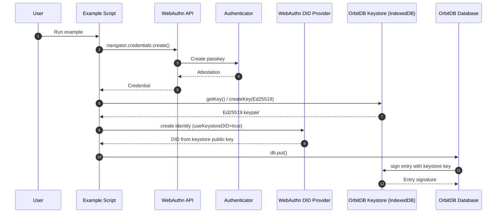
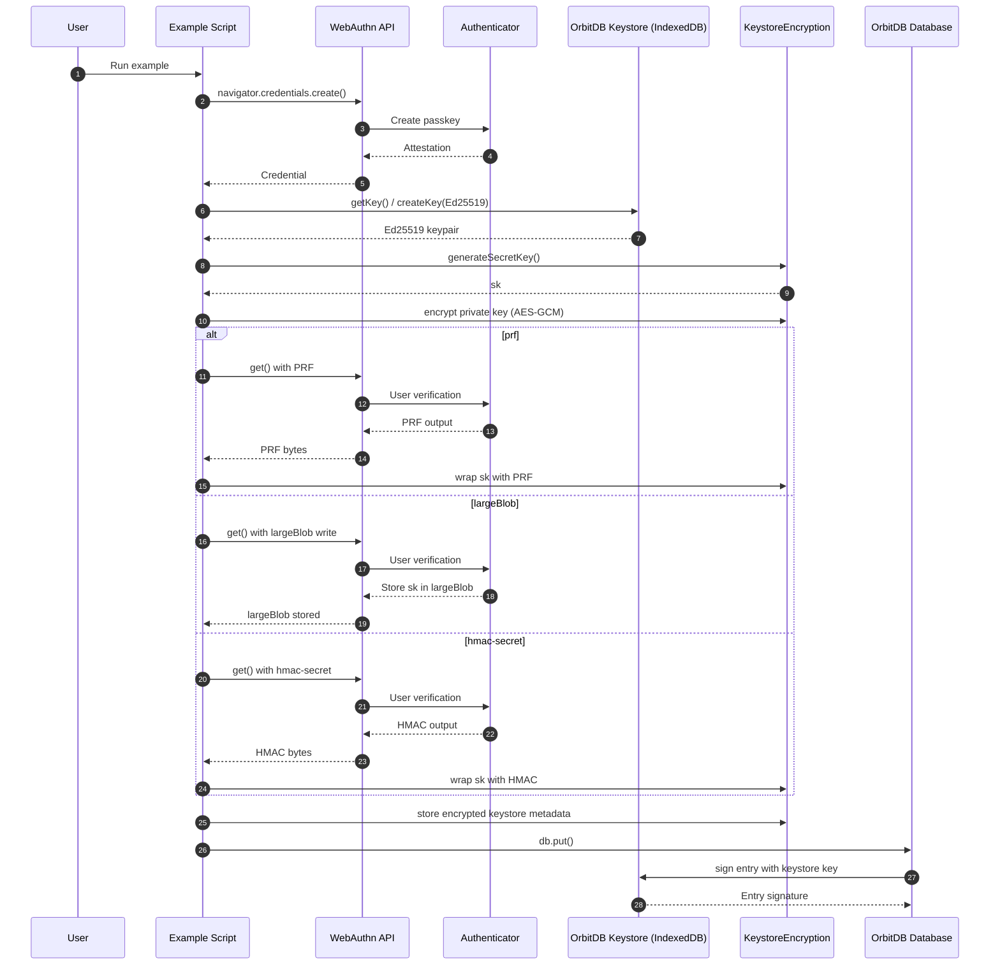
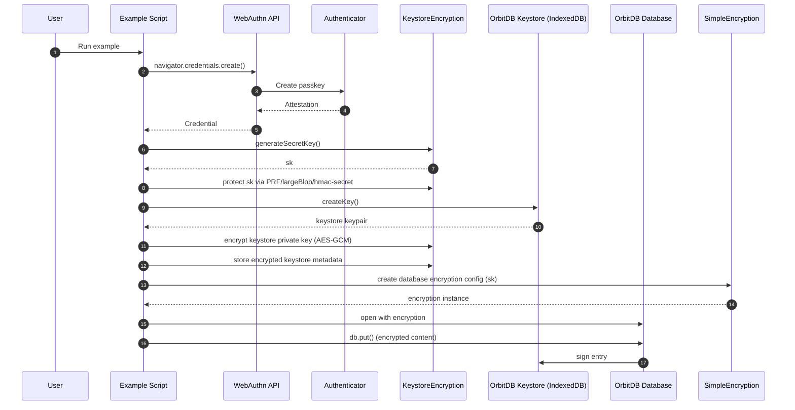

# Example Sequences

Mermaid sequences for the JavaScript examples in `examples/`.

## `examples/ed25519-keystore-did-example.js`

## `examples/encrypted-keystore-example.js`

## `examples/simple-encryption-integration.js`

