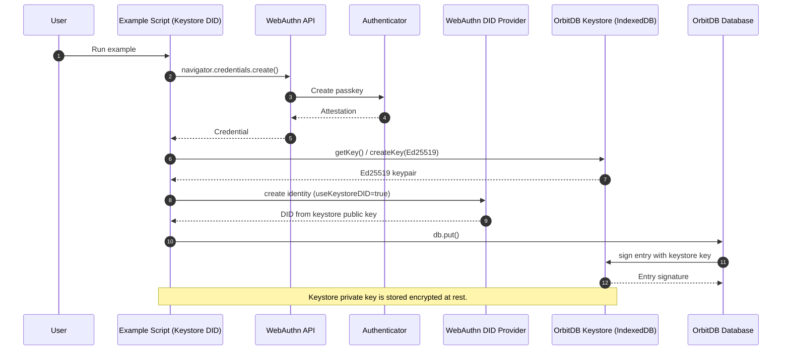
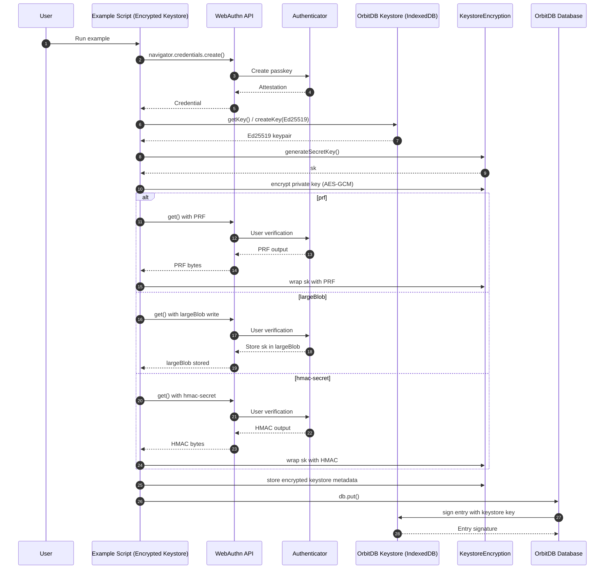
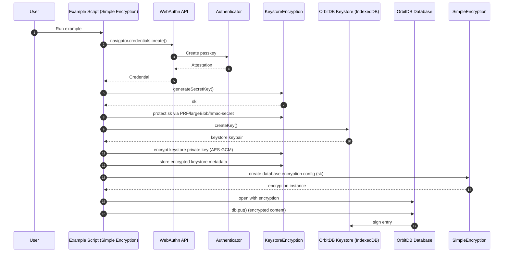
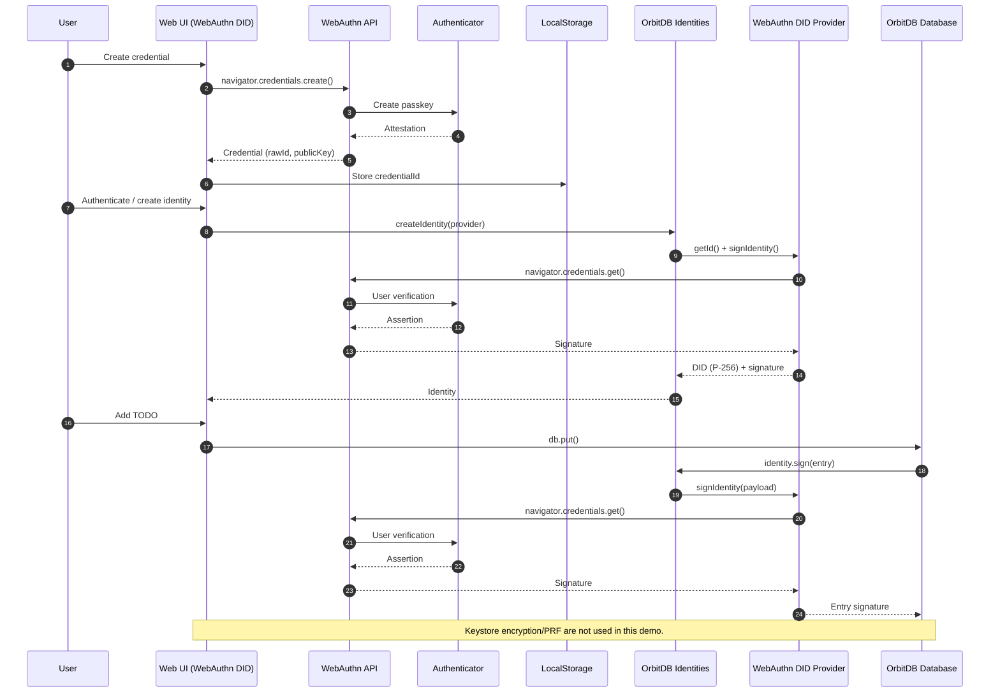
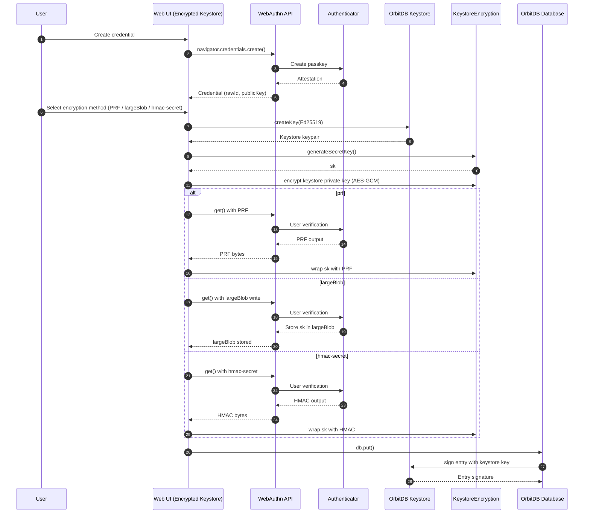
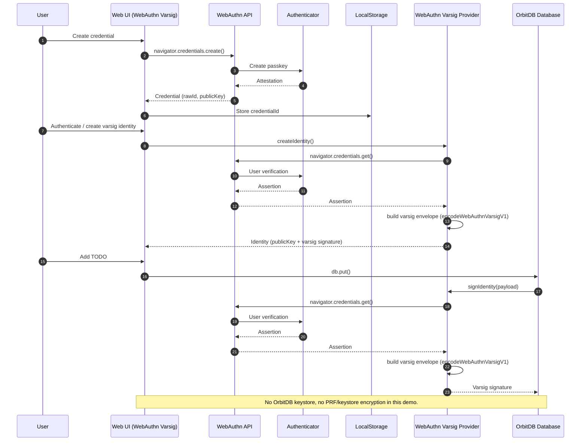

# Example Sequences

Mermaid sequences for the JavaScript examples in `examples/`.

## `examples/ed25519-keystore-did-example.js` (tests: `tests/ed25519-keystore-did.test.js`)

## `examples/encrypted-keystore-example.js` (tests: `tests/encrypted-keystore.test.js`)

## `examples/simple-encryption-integration.js` (tests: `tests/simple-encryption-integration.test.js`)

## `examples/webauthn-todo-demo` (tests: `tests/webauthn-focused.test.js`, `tests/webauthn-integration.test.js`, `tests/webauthn-logging-e2e.test.js`, `tests/webauthn-verification.test.js`)

## `examples/ed25519-encrypted-keystore-demo` (tests: `tests/ed25519-encrypted-keystore-e2e.test.js`)

## `examples/webauthn-varsig-demo` (tests: `tests/webauthn-varsig-e2e.test.js`)

