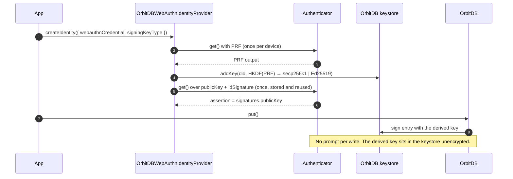
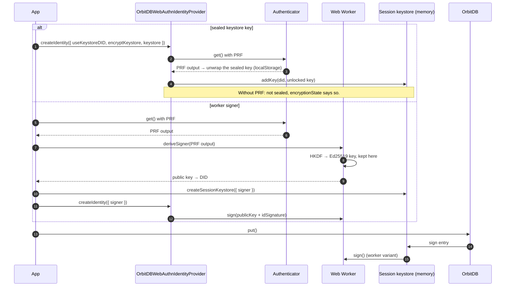
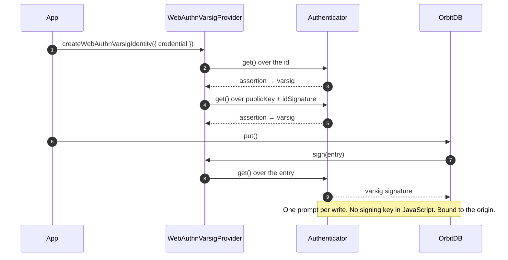

# Example sequences

One section per way of using the package. Each names the module that builds
the identity for that option — the demos import it, and so can you — and the
browser suite that drives the demo through a real authenticator (Chromium's
virtual one in CI).

The four scripted examples that used to live in `examples/*.js` are gone.
None of them ran: they read `window.location` in Node and `process.argv` in
the browser, one imported a function that did not exist, and no test ever
executed them. The sequences they described were also wrong about what
signs (see the README's option table).

## 1. Default path — passkey DID, a key derived from the passkey

Module: `examples/shared/lib/options/default-path.js` · Demo:
`examples/webauthn-todo-demo` · Suite: `tests/webauthn-default-path.test.js`

```mermaid
sequenceDiagram
  autonumber
  participant App
  participant Prov as OrbitDBWebAuthnIdentityProvider
  participant Auth as Authenticator
  participant KS as OrbitDB keystore
  participant DB as OrbitDB

  App->>Prov: createIdentity({ webauthnCredential, signingKeyType })
  Prov->>Auth: get() with PRF (once per device)
  Auth-->>Prov: PRF output
  Prov->>KS: addKey(did, HKDF(PRF) → secp256k1 | Ed25519)
  Prov->>Auth: get() over publicKey + idSignature (once, stored and reused)
  Auth-->>Prov: assertion = signatures.publicKey
  App->>DB: put()
  DB->>KS: sign entry with the derived key
  Note over Auth,DB: No prompt per write. The derived key sits in the keystore unencrypted.
```

What a peer verifies: the assertion binds the DID's key to the derived key
(`verifyWebAuthnIdentityBinding`), then each entry's signature by that key.

## 2. Keystore DID, sealed by the passkey — or signed in a Web Worker

Module: `examples/shared/lib/options/encrypted-keystore.js` · Demo:
`examples/ed25519-encrypted-keystore-demo` · Suite:
`tests/ed25519-encrypted-keystore-e2e.test.js`

Both variants give OrbitDB `createSessionKeystore()`; with the default
keystore the unlocked key would be written to IndexedDB in clear.

```mermaid
sequenceDiagram
  autonumber
  participant App
  participant Prov as OrbitDBWebAuthnIdentityProvider
  participant Auth as Authenticator
  participant W as Web Worker
  participant KS as Session keystore (memory)
  participant DB as OrbitDB

  alt sealed keystore key
    App->>Prov: createIdentity({ useKeystoreDID, encryptKeystore, keystore })
    Prov->>Auth: get() with PRF
    Auth-->>Prov: PRF output → unwrap the sealed key (localStorage)
    Prov->>KS: addKey(did, unlocked key)
    Note over Prov,KS: Without PRF: not sealed, encryptionState says so.
  else worker signer
    App->>Auth: get() with PRF
    Auth-->>App: PRF output
    App->>W: deriveSigner(PRF output)
    W->>W: HKDF → Ed25519 key, kept here
    W-->>App: public key → DID
    App->>KS: createSessionKeystore({ signer })
    App->>Prov: createIdentity({ signer })
    Prov->>W: sign(publicKey + idSignature)
  end
  App->>DB: put()
  DB->>KS: sign entry
  KS->>W: sign() (worker variant)
```

What a peer verifies: the DID's key equals the identity's public key
(keystore-DID rule), then each entry's signature.

## 3. Varsig — the passkey signs every write

Module: `examples/shared/lib/options/varsig.js` · Demo:
`examples/webauthn-varsig-demo` · Suite: `tests/webauthn-varsig-e2e.test.js`

```mermaid
sequenceDiagram
  autonumber
  participant App
  participant Prov as WebAuthnVarsigProvider
  participant Auth as Authenticator
  participant DB as OrbitDB

  App->>Prov: createWebAuthnVarsigIdentity({ credential })
  Prov->>Auth: get() over the id
  Auth-->>Prov: assertion → varsig
  Prov->>Auth: get() over publicKey + idSignature
  Auth-->>Prov: assertion → varsig
  App->>DB: put()
  DB->>Prov: sign(entry)
  Prov->>Auth: get() over the entry
  Auth-->>DB: varsig signature
  Note over Auth,DB: One prompt per write. No signing key in JavaScript. Bound to the origin.
```

What a peer verifies: both identity varsigs against the key the DID
encodes (`verifyVarsigIdentity`), then each entry's varsig.

## Prompt counts

|                 | Create                                 | First authenticate | Later sessions | Per write |
| --------------- | -------------------------------------- | ------------------ | -------------- | --------- |
| Default         | 1 (+1 largeBlob write where supported) | 2                  | 0              | 0         |
| Sealed keystore | 1 (+1)                                 | 2 (seal, unlock)   | 1              | 0         |
| Worker signer   | 1 (+1)                                 | 1                  | 1              | 0         |
| Varsig          | 1 (+1)                                 | 2                  | 2              | 1         |

The demos count these at the WebAuthn API (`examples/shared/lib/prompt-counter.js`)
and the suites assert them.
