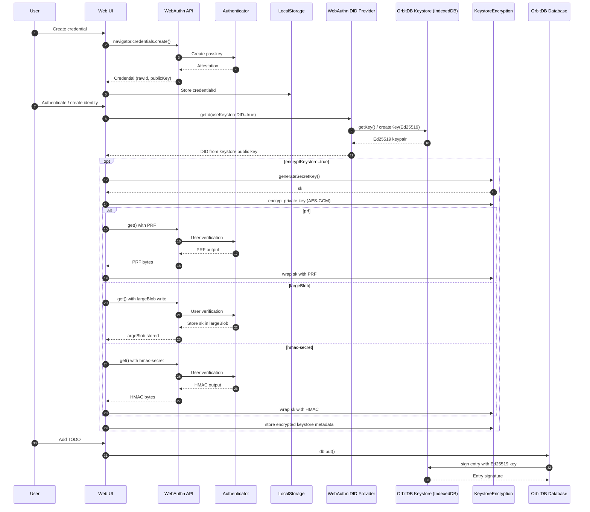

# Ed25519 Encrypted Keystore Demo

This demo showcases the **Ed25519 Keystore DID** and **WebAuthn-Encrypted Keystore** features for OrbitDB.

## Features Demonstrated

### 🆔 Ed25519 Keystore DID
- Create Ed25519 DIDs from OrbitDB keystore instead of P-256 from WebAuthn
- Unified identity: same key for DID and database operations  
- Better UCAN compatibility

### 🔐 WebAuthn-Encrypted Keystore
- Encrypt OrbitDB keystore with AES-GCM 256-bit
- Secret key protected by WebAuthn hardware (largeBlob or hmac-secret)
- One biometric prompt per session
- Protected from XSS, malicious extensions, and device theft

## Running the Demo

Install dependencies:
\`\`\`sh
npm install
\`\`\`

Start the development server:
\`\`\`sh
npm run dev
\`\`\`

Open your browser to the URL shown (typically http://localhost:5173)

## Using the Demo

1. **Create Credential**: Click to create a WebAuthn credential (biometric prompt)
2. **Choose Security Options**:
   - ☑️ Use Ed25519 DID from keystore
   - ☑️ Encrypt keystore with WebAuthn
   - Select encryption method (largeBlob or hmac-secret)
3. **Authenticate**: Click to authenticate and set up OrbitDB
4. **Add TODOs**: Your data is now secured with the selected options!

## Browser Support

- **Ed25519 DID**: All browsers with WebAuthn
- **largeBlob encryption**: Chrome 106+, Edge 106+
- **hmac-secret encryption**: Chrome, Firefox, Edge

## Sequence

