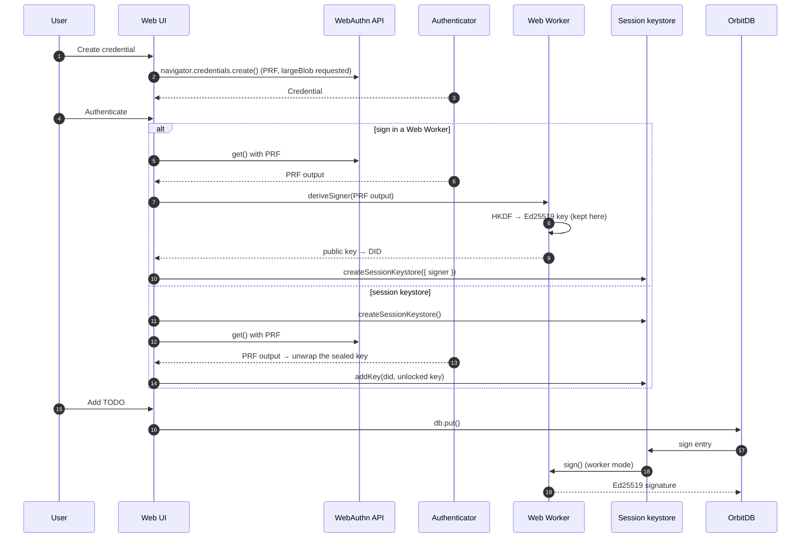

# Ed25519 Encrypted Keystore Demo

The DID is an Ed25519 key of OrbitDB's keystore, not the passkey's own key,
and the passkey guards that key. Two ways to do that, one toggle apart:

| | Session keystore (default) | Sign in a Web Worker |
| --- | --- | --- |
| Where the signing key is | in page memory, for the session | in a Web Worker; the page never holds it |
| Where it comes from | generated once, then sealed | derived from the passkey's PRF output, every session |
| At rest | a copy sealed with AES-GCM-256 in localStorage; the wrapping key from PRF | nothing |
| Same DID on a second device | no — the sealed copy would have to travel | yes |
| Prompts per session | 1 (unlock) | 1 (the PRF seed) |
| Prompts per write | 0 | 0 |

In both modes OrbitDB gets a keystore that forgets (`createSessionKeystore()`).
That is what makes "encrypted at rest" true: OrbitDB signs with whatever its
keystore returns, and its default keystore writes every key it holds to
IndexedDB — with it, the unlocked key sat on disk in clear and the sealed copy
protected nothing after the first session.

Without PRF nothing is sealed and nothing is derived: the session keystore
carries a plain key for the session and the panel says **NOT encrypted**; the
worker mode refuses. The demo used to fall back to the credential id as the
"PRF seed", a value that sits in localStorage in clear.

## What the panel shows

After authenticating: the signing backend, the key's type and where it lives,
what is at rest (read from the provider's `encryptionState`, not assumed), the
identity document's hash, and how many times the page asked the authenticator
this session. In worker mode also the worker's DID — which is the identity's
DID — and the seed source.

"Verified" on a todo is the verdict of `examples/shared/lib/verification.js`
on the entry behind it (entry signature, identity block, DID binding, write
list); the panel below runs the same verifier on an edited entry and on an
impostor claiming your DID, and both must be rejected.

This demo runs a single peer. There is no relay or bootstrap; the verification
is what a second peer would do on receipt.

## Running the demo

The demos are one pnpm workspace; install once in `examples/`:

```sh
pnpm install --frozen-lockfile                    # repository root, for the library
pnpm --dir examples install --frozen-lockfile
pnpm --dir examples/ed25519-encrypted-keystore-demo run dev
```

## Sequence


```mermaid
sequenceDiagram
  autonumber
  participant User
  participant App as Web UI
  participant WebAuthn as WebAuthn API
  participant Auth as Authenticator
  participant Worker as Web Worker
  participant KS as Session keystore
  participant DB as OrbitDB

  User->>App: Create credential
  App->>WebAuthn: navigator.credentials.create() (PRF, largeBlob requested)
  Auth-->>App: Credential

  User->>App: Authenticate
  alt sign in a Web Worker
    App->>WebAuthn: get() with PRF
    Auth-->>App: PRF output
    App->>Worker: deriveSigner(PRF output)
    Worker->>Worker: HKDF → Ed25519 key (kept here)
    Worker-->>App: public key → DID
    App->>KS: createSessionKeystore({ signer })
  else session keystore
    App->>KS: createSessionKeystore()
    App->>WebAuthn: get() with PRF
    Auth-->>App: PRF output → unwrap the sealed key
    App->>KS: addKey(did, unlocked key)
  end

  User->>App: Add TODO
  App->>DB: db.put()
  DB->>KS: sign entry
  KS->>Worker: sign() (worker mode)
  Worker-->>DB: Ed25519 signature
```
