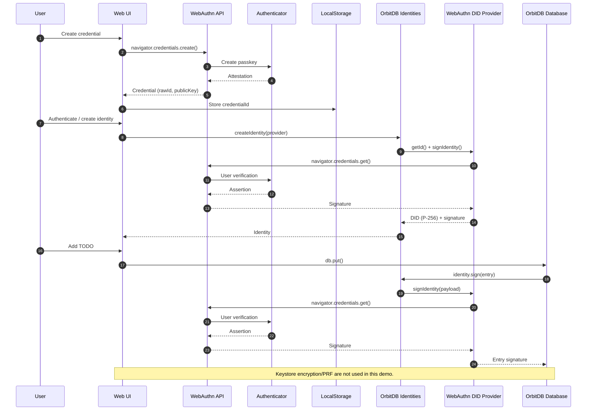

# WebAuthn Todo Demo

This demo uses the WebAuthn DID provider (P-256 DID) and signs each database write with a WebAuthn assertion. It does not use the OrbitDB keystore for signing unless you change the provider options.

## Running the demo

Install dependencies:
```sh
npm install
```

Start the dev server:
```sh
npm run dev
```

Open the URL shown (typically http://localhost:5173).

## Sequence


