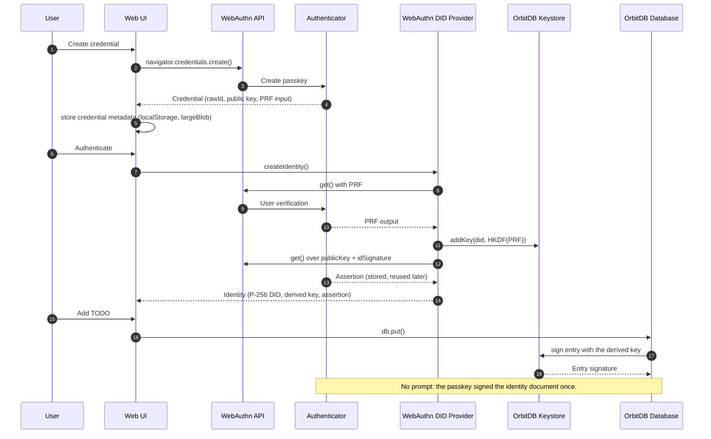

# WebAuthn Todo Demo — the default path

The DID is the passkey's own P-256 public key. OrbitDB entries are signed by a
**secp256k1 key derived from the passkey**: the provider asks the authenticator
for its PRF output once and runs it through HKDF-SHA256, domain-separated by
the DID, before OrbitDB reaches for a signing key. The same passkey therefore
yields the same identity document on every device.

The passkey itself signs exactly once: the identity document
(`signatures.publicKey` is a WebAuthn assertion). That assertion is stored and
reused, so later sessions and every write cost **no prompt at all**. What a
peer verifies is that assertion — the key the DID encodes signed for the
derived key — and then each entry's signature by the derived key.

Two things this README used to claim and the code never did: it does not sign
every write with WebAuthn (that is the varsig demo), and it does use the
OrbitDB keystore for signing.

## Prompts and what sits at rest

| When                     | Prompts | Why                                                          |
| ------------------------ | ------- | ------------------------------------------------------------ |
| Create credential        | 1       | registration                                                 |
| First authenticate       | 2       | PRF output for the derived key, then the identity assertion  |
| Later sessions           | 0       | the derived key and the stored assertion are reused          |
| Each write               | 0       | OrbitDB signs with the derived key                           |
| Use Existing Passkey     | 1       | a discoverable assertion that also reads largeBlob           |

At rest, in this browser's IndexedDB (`./orbitdb/identities`): the derived
signing key, **unencrypted**. `encryptKeystore` does not apply to this path —
see the [encrypted keystore demo](../ed25519-encrypted-keystore-demo/) for the
option that seals the signing key. Without PRF support, the keystore
generates a key instead; that identity works, but stays on one device.

## What the badges mean

"Verified" on a todo is the verdict of `examples/shared/lib/verification.js`
on the entry behind it: the entry's signature by the writer key, the identity
block naming that key, that block verifying for its DID (0.5.2+), and the
writer's DID in the write list. The panel below the list runs the same verifier
on an edited entry and on an impostor claiming your DID; both must be
rejected.

This demo runs a single peer. There is no relay or bootstrap; `sync` finds
nobody. The verification is what a second peer would do on receipt.

## Running the demo

The demos are one pnpm workspace; install once in `examples/`:

```sh
pnpm install --frozen-lockfile                    # repository root, for the library
pnpm --dir examples install --frozen-lockfile
pnpm --dir examples/webauthn-todo-demo run dev
```

## Sequence


```mermaid
sequenceDiagram
  autonumber
  participant User
  participant App as Web UI
  participant WebAuthn as WebAuthn API
  participant Auth as Authenticator
  participant Prov as WebAuthn DID Provider
  participant KS as OrbitDB Keystore
  participant DB as OrbitDB Database

  User->>App: Create credential
  App->>WebAuthn: navigator.credentials.create()
  WebAuthn->>Auth: Create passkey
  Auth-->>App: Credential (rawId, public key, PRF input)
  App->>App: store credential metadata (localStorage, largeBlob)

  User->>App: Authenticate
  App->>Prov: createIdentity()
  Prov->>WebAuthn: get() with PRF
  WebAuthn->>Auth: User verification
  Auth-->>Prov: PRF output
  Prov->>KS: addKey(did, HKDF(PRF))
  Prov->>WebAuthn: get() over publicKey + idSignature
  Auth-->>Prov: Assertion (stored, reused later)
  Prov-->>App: Identity (P-256 DID, derived key, assertion)

  User->>App: Add TODO
  App->>DB: db.put()
  DB->>KS: sign entry with the derived key
  KS-->>DB: Entry signature
  Note over Auth,DB: No prompt: the passkey signed the identity document once.
```
