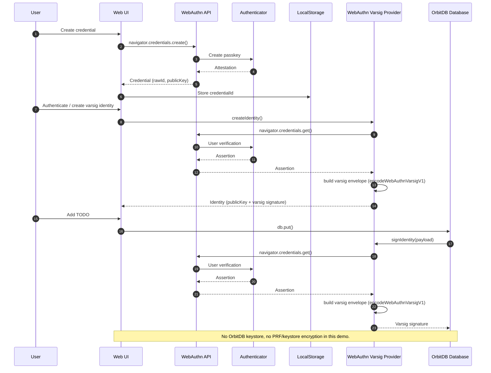

# WebAuthn Varsig Todo Demo

This demo uses WebAuthn varsig signatures to create an OrbitDB identity without a separate browser keystore. All OrbitDB entry signatures are produced directly by your passkey.

## What it demonstrates

- WebAuthn varsig identity creation (Ed25519 or P-256, depending on authenticator support)
- No additional OrbitDB keystore in the browser
- OrbitDB database operations signed with passkey-generated varsig signatures

## Running the demo

Install dependencies:
```sh
npm install
```

Start the dev server:
```sh
npm run dev
```

Open the URL shown (typically http://localhost:5173).

## Using the demo

1. Create a WebAuthn credential (passkey prompt).
2. Authenticate to create a varsig-backed OrbitDB identity.
3. Add TODOs. Each write will trigger a passkey assertion.

## Notes

- Each database write requires a WebAuthn assertion, so expect frequent biometric prompts.
- Ed25519 support depends on your authenticator; otherwise the demo falls back to P-256.

## Sequence


