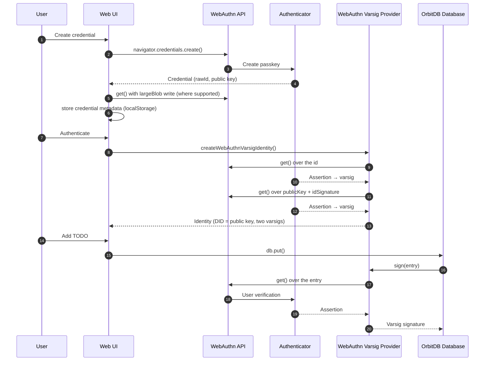

# WebAuthn Varsig Todo Demo

The passkey signs every entry. There is no signing key in JavaScript at all:
the DID is the passkey's public key (Ed25519 or P-256, whatever the
authenticator holds), and each OrbitDB write is a WebAuthn assertion wrapped in
a varsig envelope.

## Prompts

| When                 | Prompts | Why                                                       |
| -------------------- | ------- | --------------------------------------------------------- |
| Create credential    | 1–2     | registration, plus a largeBlob write where supported      |
| Authenticate         | 2       | one assertion for the id, one for the public key          |
| Each put/toggle/delete | 1     | the entry's varsig                                        |
| Use Existing Passkey | 1       | a discoverable assertion that also reads largeBlob        |

The identity document is not cached, so every login costs the two assertions
again.

## What the badges mean

"Verified" on a todo is the verdict of `examples/shared/lib/verification.js`
on the entry behind it: the varsig verifies for the writer key, the identity
block carries that key and its DID is that key (0.5.3), and the writer is in
the write list. The panel below the list runs the same verifier on an edited
entry and on an impostor claiming your DID; both must be rejected. Until 0.5.3
the impostor was accepted on this path.

Two limits worth knowing:

- Varsig assertions are bound to the origin. Entries written here verify only
  on this origin; a peer on another one rejects every one of them.
- This demo runs a single peer. There is no relay or bootstrap; the
  verification is what a second peer would do on receipt.

## Recovery

"Use Existing Passkey" asks for a discoverable assertion and reads the varsig
metadata back from the passkey's largeBlob, falling back to localStorage. The
metadata is data, not a claim the authenticator vouches for: the DID is
recomputed from the public key, and the metadata has to belong to the
credential that just signed.

## Running the demo

The demos are one pnpm workspace; install once in `examples/`:

```sh
pnpm install --frozen-lockfile                    # repository root, for the library
pnpm --dir examples install --frozen-lockfile
pnpm --dir examples/webauthn-varsig-demo run dev
```

The browser test (`tests/webauthn-varsig-e2e.test.js`) drives this UI with
Chromium's virtual authenticator. The demo used to honour a
`window.__PLAYWRIGHT__` flag that faked the credential and skipped OrbitDB;
that flag is gone.

## Sequence


```mermaid
sequenceDiagram
  autonumber
  participant User
  participant App as Web UI
  participant WebAuthn as WebAuthn API
  participant Auth as Authenticator
  participant Prov as WebAuthn Varsig Provider
  participant DB as OrbitDB Database

  User->>App: Create credential
  App->>WebAuthn: navigator.credentials.create()
  WebAuthn->>Auth: Create passkey
  Auth-->>App: Credential (rawId, public key)
  App->>WebAuthn: get() with largeBlob write (where supported)
  App->>App: store credential metadata (localStorage)

  User->>App: Authenticate
  App->>Prov: createWebAuthnVarsigIdentity()
  Prov->>WebAuthn: get() over the id
  Auth-->>Prov: Assertion → varsig
  Prov->>WebAuthn: get() over publicKey + idSignature
  Auth-->>Prov: Assertion → varsig
  Prov-->>App: Identity (DID = public key, two varsigs)

  User->>App: Add TODO
  App->>DB: db.put()
  DB->>Prov: sign(entry)
  Prov->>WebAuthn: get() over the entry
  WebAuthn->>Auth: User verification
  Auth-->>Prov: Assertion
  Prov-->>DB: Varsig signature
```
